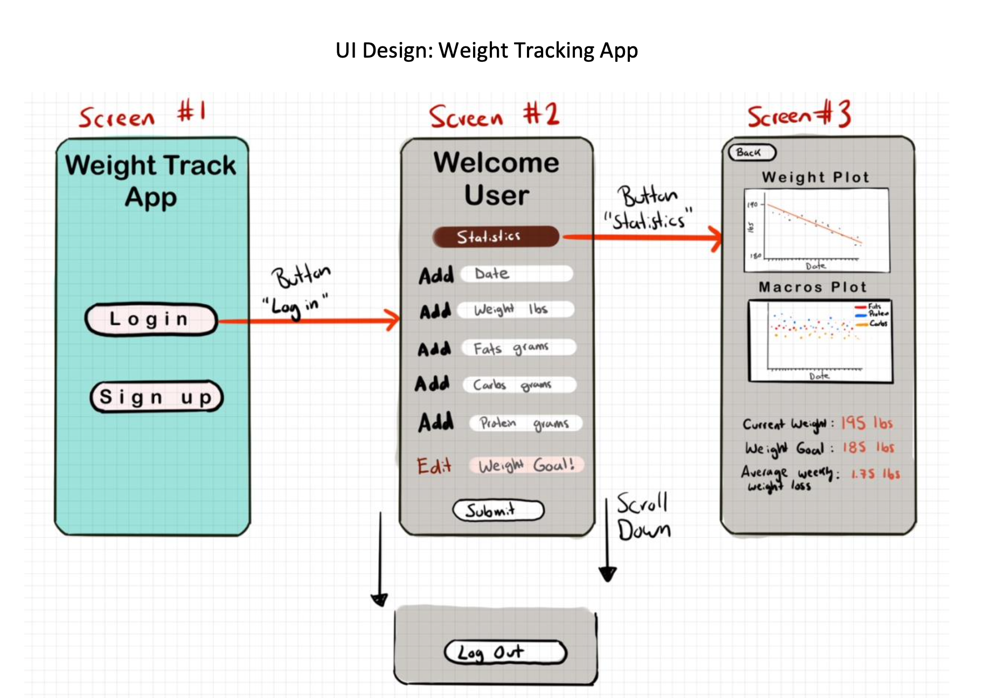
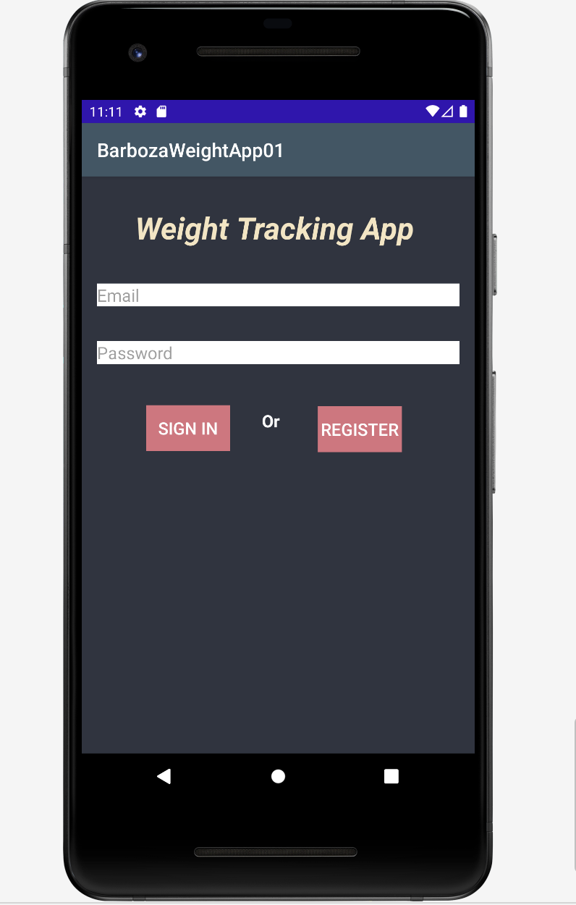

<h2>CS360 Mobile App Project: Weight Tracking App</h2>

<h3> Summary </h3> 
  

On this app project I designed and programmed a weight tracking app using Java on Android Studio. The user is able to track their daily weight and Macros (carbs, fats and proteins) to help them achieve their goal. The forst screen of the app will allow users to log in or create an account using their email and password. Once the user is logged in, they will go to the second screen of the app where they can start adding data into the database. There is an additional button called "statistics" where users are able to see statistics and plot charts of their data. 

<h3> Features and UI sketch </h3> 

The features and design I created is shown on the image below. I spend a good amount of time thinking about the UI for my app since this phase of the development is the most important in my opinion since a bad UI//UX will cause users to stay away from the app no matter how good the back-end development is. The UI was kept simple and at the same time interactive to help new users naviagte smoothly around the app and understand all the features. I also made sure the words are easy to read, making easy on the eyes. 

<h3> Coding </h3> 

When it came to the development of the project, I used Android Studio to code the Java files and .xml files for the layouts of the app. I began coding and designing the .xml files first (front-end) of the app before going into the back-end. Once I designed the front-end, I moved to the back-end using Java as my main programming language. 

<h3> Test Phase </h3> 

When it came to testing the app, I tested the app on an android device as seen on the image below. I made sure there were no errors when running the project and see if the app was working on the android device. 

